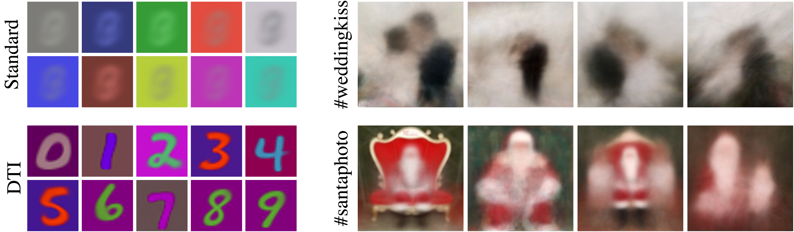

# DTI-Clustering

Pytorch implementation of [**"Deep Transformation-Invariant 
Clustering"**](https://arxiv.org/abs/2006.11132) paper (accepted at NeurIPS 2020 as an oral)

Check out our [**paper**](https://arxiv.org/abs/2006.11132) and 
[**webpage**](http://imagine.enpc.fr/~monniert/DTIClustering) for details!



If you find this code useful in your research, please cite:

```
@inproceedings{monnier2020dticlustering,
  title={{Deep Transformation-Invariant Clustering}},
  author={Monnier, Tom and Groueix, Thibault and Aubry, Mathieu},
  booktitle={NeurIPS},
  year={2020},
}
```

## Installation :construction_worker:

### 1. Create conda environment

```
conda env create -f environment.yml
conda activate dti-clustering
```

**Optional:** some monitoring routines are implemented, you can use them by specifying the 
visdom port in the config file. You will need to install `visdom` from source beforehand

```
git clone https://github.com/facebookresearch/visdom
cd visdom && pip install -e .
```

### 2. Download non-torchvision datasets

Following script will download `affNIST-test` and `FRGC` datasets, as well as our unfiltered 
Instagram collections associated to 
[#santaphoto](https://www.instagram.com/explore/tags/santaphoto/) and 
[#weddingkiss](https://www.instagram.com/explore/tags/weddingkiss/):

```
./download_data.sh
```

**NB:** it may happen that `gdown` hangs, if so you can download them by hand with following 
gdrive links, then unzip and move them to the `datasets` folder:

- [affNist source
  link](https://www.cs.toronto.edu/~tijmen/affNIST/32x/transformed/test.mat.zip)
- [FRGC source
  link](https://github.com/XifengGuo/JULE-Torch/blob/master/datasets/FRGC/data4torch.h5)
- [IG santaphoto gdrive 
  link](https://drive.google.com/file/d/1tv5-\_Iz-LD6-FqFxF67py9ot97BOZbUc/view?usp=sharing)
- [IG weddingkiss gdrive 
  link](https://drive.google.com/file/d/1OCLvojYDomLnI6zP6QghgIkZ8PWwmqCD/view?usp=sharing)


## How to use :rocket:

### 1. Launch a training

```
cuda=gpu_id config=filename.yml tag=run_tag ./pipeline.sh
```

where:
- `gpu_id` is a target cuda device id,
- `filename.yml` is a YAML config located in `configs` folder,
- `run_tag` is a tag for the experiment.

Results are saved at `runs/${DATASET}/${DATE}_${run_tag}` where `DATASET` is the dataset name 
specified in `filename.yml` and `DATE` is the current date in `mmdd` format. Some training 
visual results like prototype evolutions and transformation prediction examples will be 
saved. Here is an example of learned MNIST prototypes and transformation predictions for a 
given query image:

#### Prototypes


#### Transformation predictions


### 2. Reproduce our quantitative results on MNIST-test (10 runs)

```
cuda=gpu_id config=mnist_test.yml tag=dtikmeans ./multi_pipeline.sh
```

Switch the model name to `dtigmm` in the config file to reproduce results for DTI GMM. 
Available configs are:

- affnist_test.yml
- fashion_mnist.yml
- frgc.yml
- mnist.yml
- mnist_1k.yml
- mnist_color.yml
- mnist_test.yml
- svhn.yml
- usps.yml

### 3. Reproduce our qualitative results on Instagram collections

1. (**skip if you already downloaded data using script above**) Create a santaphoto dataset 
   by running `process_insta_santa.sh` script. It can take a while to scrape the 10k posts 
   from Instagram.
2. Launch training with `cuda=gpu_id config=instagram.yml tag=santaphoto ./pipeline.sh`

That's it! You can apply the process to other IG hashtags like 
[#trevifountain](https://www.instagram.com/explore/tags/trevifountain/) or
[#weddingkiss](https://www.instagram.com/explore/tags/weddingkiss/) and discover 
prototypes similar to:


### 4. Reproduce our qualitative results on MegaDepth

1. You need to download desired landmarks from the original MegaDepth project 
   [webpage](https://www.cs.cornell.edu/projects/megadepth/), e.g. Florence 
   Cathedral
2. Move images to a `datasets/megadepth/firenze/train` folder
3. Launch training with `cuda=gpu_id config=megadepth.yml tag=firenze ./pipeline.sh`

You should end up with 20 learned prototypes and random sample examples in each cluster. To 
assess the quality of clustering, you can visualized for each cluster, the prototype, random 
samples and transformed prototypes like:


## Further information

If you like this project, please check out related works from our group:

#### Follow-ups

- [Monnier et al. - Unsupervised Layered Image Decomposition into Object Prototypes (arXiv 
  2021)](https://arxiv.org/abs/2104.14575)

#### Previous works on deep transformations

- [Deprelle et al. - Learning elementary structures for 3D shape generation and matching 
  (NeurIPS 2019)](https://arxiv.org/abs/1908.04725)
- [Groueix et al. - 3D-CODED: 3D Correspondences by Deep Deformation (ECCV
  2018)](https://arxiv.org/abs/1806.05228)
- [Groueix et al. - AtlasNet: A Papier-Mache Approach to Learning 3D Surface Generation (CVPR 
  2018)](https://arxiv.org/abs/1802.05384)
